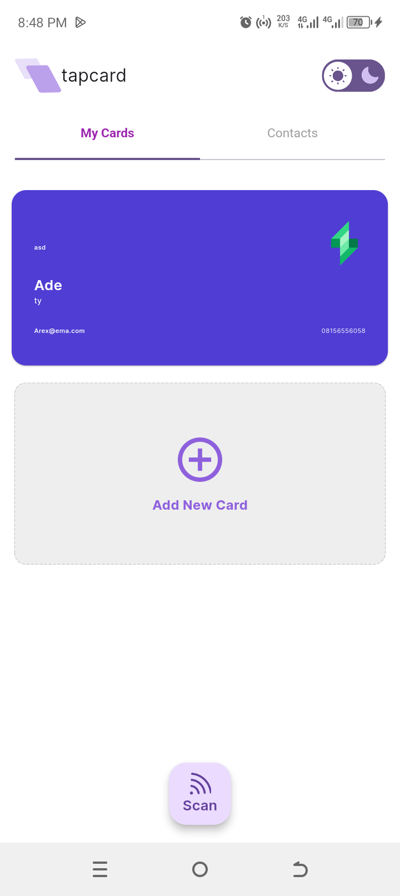
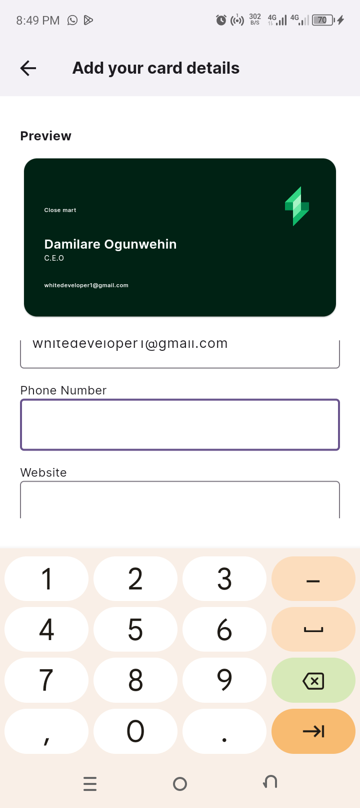
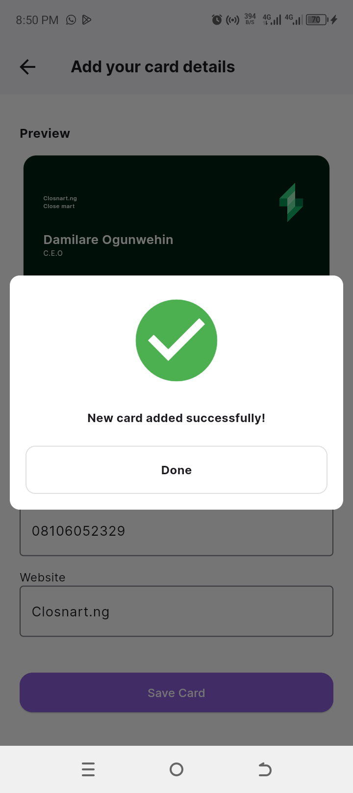
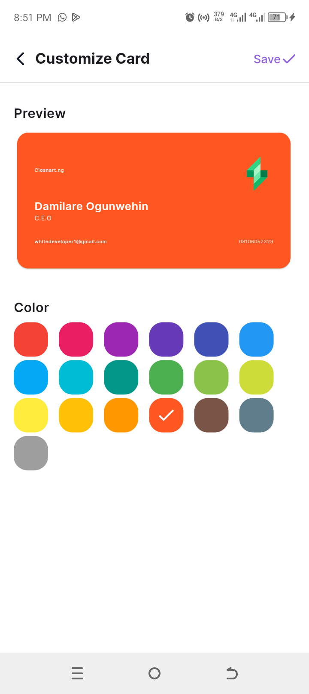

# Tapcard

## Overview

Welcome to Tapcard! Tapcard is a powerful and user-friendly application designed to streamline the process of digital business card sharing. Whether you're networking at an event, meeting new clients, or just want to exchange contact details seamlessly, Tapcard has got you covered.

## Features

- **Digital Business Cards**: Create and customize your digital business card with personal details, company information, social media links, and more
- **NFC Support**: Tapcard supports NFC technology, allowing you to share your card by simply tapping your phone with another NFC-enabled device.
- **Contact Management**: Save and manage contacts within the app, making follow-ups and networking more efficient.
- **Privacy and Security**: Control what information you share and with whom, ensuring your data stays private and secure.

## Getting Started

To start using Tapcard, follow these simple steps:

### Prerequisites

- Ensure you have a compatible android device (minimum od Android 8)
- Make sure your device supports NFC, if you wish to use these features.

### Download

- **[APK Download]:** (https://drive.google.com/file/d/13TxF7Qsc1Du18hsoJyhIMYkEgU5ODG2Y/view?usp=drivesdk)
- **[GitHub]**:(https://github.com/Damigrace1/TapCardApp)
- **[Figma Design]**:(https://www.figma.com/design/IQcbrxkevs9FzEweXbOH3v/TEAM-KIMIKO-(TELEX)---NFC-PROJECTS?node-id=1203-5993&t=2YiFAagW3O2boMqf-0)

### Usage

#### 1. Display of cards in My Cards and click on add card to create your new business card

#### 2. Fill in all required information for your business card

#### 3. Save card

#### 4.  Customize card Color

### Project Installation

1. **Clone the Repository**:
   
   git clone https://github.com/Damigrace1/TapCardApp.git

2.  **Navigate to the Project Directory**:
    
    cd Tapcard

3. **Install Dependencies**:
  
    flutter pub get

4. **Run the application**:
   
    flutter run

## Colaborators

1. Damilare Ogunwehin - Team Lead
2. David Ohimai Ohiosimuan
3. Ezekiel Chukwudumebi
4. Olaleye Nathaniel Oluwatosin
5. Tosin Ezekiel

# License

Tapcard is open-source and available under the MIT License.

Thank you for using Tapcard! Happy networking!